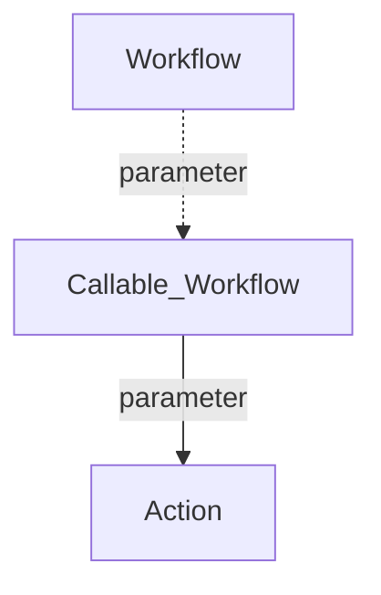

<div id="top" align="center">
<h1>GH Action doctoc</h1>

<p>GH Action to create Table of Contents in Markdonw files</p>

[Report Issue](https://github.com/Zheng-Bote/gha-doctoc/issues) [Request Feature](https://github.com/Zheng-Bote/gha-doctoc/pulls)

[](https://choosealicense.com/licenses/mit/)


</div>

<hr>

<!-- START doctoc generated TOC please keep comment here to allow auto update -->
<!-- DON'T EDIT THIS SECTION, INSTEAD RE-RUN doctoc TO UPDATE -->
**Table of Contents**

- [Description](#description)
  - [Features](#features)
- [Status](#status)
- [Installation](#installation)
  - [Dependencies](#dependencies)
- [folder structure](#folder-structure)
- [Usage/Examples](#usageexamples)
- [API Reference](#api-reference)
  - [Parameters](#parameters)
  - [Inputs](#inputs)
  - [Outputs](#outputs)
- [Documentation](#documentation)
  - [Github Page](#github-page)
  - [Screenshots](#screenshots)
- [Authors and License](#authors-and-license)
  - [License](#license)
  - [Authors](#authors)
  - [Code Contributors](#code-contributors)

<!-- END doctoc generated TOC please keep comment here to allow auto update -->

<hr>

# Description


Github Action generates table of contents for markdown files inside local git repository.

> \[!NOTE]
> Based on Node.js application [DocToc](https://github.com/thlorenz/doctoc) created by [Thorsten Lorenz](https://github.com/thlorenz) and 

## Features

- \[x] works as designed
- \[ ] no bugs

<p align="right">(<a href="#top">back to top</a>)</p>

# Status


[](https://github.com/Zheng-Bote/gha-doctoc/actions/workflows/repo-create_tree_readme.yml)
[](https://github.com/Zheng-Bote/gha-doctoc/actions/workflows/repo-actions_docu.yml)
[](https://github.com/Zheng-Bote/gha-doctoc/actions/workflows/repo-create_doctoc.yml)

<p align="right">(<a href="#top">back to top</a>)</p>

# Installation

just use it ;-)

> [!Note]
> not yet tested with GHES

## Dependencies

[DocToc](https://github.com/thlorenz/doctoc)

# folder structure

<!-- readme-tree start -->

```
.
├── .github
│   └── workflows
│       ├── repo-actions_docu.yml
│       ├── repo-create_doctoc.yml
│       └── repo-create_tree_readme.yml
├── LICENSE
├── README.md
├── action.yml
├── dist
│   ├── index.js
│   ├── index.js.map
│   ├── licenses.txt
│   └── sourcemap-register.js
└── tree.bak

3 directories, 11 files
```

<!-- readme-tree end -->

<p align="right">(<a href="#top">back to top</a>)</p>

# Usage/Examples

see `.github/workflows/repo-create_doctoc.yml`:

```yaml
name: Repo - create TOC of README
# description: https://github.com/thlorenz/doctoc

# README.md:
# <!-- START doctoc -->
# <!-- END doctoc -->

run-name: create README table of contents by ${{ github.actor }}

on:
  workflow_dispatch:
  push:
    branches:
      - "main"
    paths:
      - "README.md"

permissions:
  contents: write

jobs:
  generateTOC:
    name: TOC Generator
    runs-on: ubuntu-latest
    steps:
      - uses: actions/checkout@v4
        with:
          fetch-depth: 0
          ref: "main"

      - uses: Zheng-Bote/gha-doctoc@main
        with:
          GITHUB_TOKEN: ${{ secrets.GITHUB_TOKEN }}
          TARGET_PATHS: ./README.md
          FOLDING: false

      - name: Verify Changed files
        uses: tj-actions/verify-changed-files@v20
        id: verify_changed_files
        with:
          files: |
            README.md

      - name: README.md changed
        if: steps.verify_changed_files.outputs.files_changed == 'false'
        run: |
          echo "README.md has no uncommitted changes"
          exit 1

      - name: commit and push
        if: steps.verify_changed_files.outputs.files_changed == 'true'
        uses: github-actions-x/commit@v2.9
        with:
          github-token: ${{ secrets.GITHUB_TOKEN }}
          push-branch: "main"
          commit-message: "appended by Github Actions"
          force-add: "true"
          files: README.md
          name: "github-actions[bot]"
          email: "github-actions[bot]@users.noreply.github.com"
```

<p align="right">(<a href="#top">back to top</a>)</p>

# API Reference

## Parameters

> \[!IMPORTANT]
> Inputs support still in progress.

## Inputs

<!-- AUTO-DOC-INPUT:START - Do not remove or modify this section -->

|                                                    INPUT                                                    |  TYPE  | REQUIRED |                                                                                                                                                                                                                                        DEFAULT                                                                                                                                                                                                                                        |                                                 DESCRIPTION                                                  |
|-------------------------------------------------------------------------------------------------------------|--------|----------|---------------------------------------------------------------------------------------------------------------------------------------------------------------------------------------------------------------------------------------------------------------------------------------------------------------------------------------------------------------------------------------------------------------------------------------------------------------------------------------|--------------------------------------------------------------------------------------------------------------|
|                         <a name="input_API_TOKEN"></a>[API_TOKEN](#input_API_TOKEN)                         | string |  false   |                                                                                                                                                                                                                                                                                                                                                                                                                                                                                       |                           Secret GitHub API token used <br>to make API requests.                             |
| <a name="input_CHECK_ONLY_DEFAULT_BRANCH"></a>[CHECK_ONLY_DEFAULT_BRANCH](#input_CHECK_ONLY_DEFAULT_BRANCH) | string |  false   |                                                                                                                                                                                                                                                                                                                                                                                                                                                                                       |                                  Whether to check only default <br>branch.                                   |
|                <a name="input_CLOSING_COMMENT"></a>[CLOSING_COMMENT](#input_CLOSING_COMMENT)                | string |  false   |                                                                                                                                                                                                                                   `"<!-- tocstop "`                                                                                                                                                                                                                                   |                                   Closing comment (for other than DocToc)                                    |
|                    <a name="input_COMMIT_EMAIL"></a>[COMMIT_EMAIL](#input_COMMIT_EMAIL)                     | string |  false   |                                                                                                                                                                                                                                                                                                                                                                                                                                                                                       |                                              Git commit email.                                               |
|                 <a name="input_COMMIT_MESSAGE"></a>[COMMIT_MESSAGE](#input_COMMIT_MESSAGE)                  | string |  false   |                                                                                                                                                                                                                              `"chore(docs): update TOC"`                                                                                                                                                                                                                              |                                               Commit message.                                                |
|                      <a name="input_COMMIT_NAME"></a>[COMMIT_NAME](#input_COMMIT_NAME)                      | string |  false   |                                                                                                                                                                                                                                                                                                                                                                                                                                                                                       |                                               Git commit name.                                               |
|                         <a name="input_CREATE_PR"></a>[CREATE_PR](#input_CREATE_PR)                         | string |  false   |                                                                                                                                                                                                                                                                                                                                                                                                                                                                                       |                                        Whether to create PullRequest.                                        |
|                      <a name="input_CUSTOM_MODE"></a>[CUSTOM_MODE](#input_CUSTOM_MODE)                      | string |  false   |                                                                                                                                                                                                                                                                                                                                                                                                                                                                                       |                                          Whether it is custom mode.                                          |
|                <a name="input_CUSTOM_TEMPLATE"></a>[CUSTOM_TEMPLATE](#input_CUSTOM_TEMPLATE)                | string |  false   |                                                                                                                                                                                                                                                                                                                                                                                                                                                                                       |                                       CUSTOM template for custom mode                                        |
|                    <a name="input_ENTRY_PREFIX"></a>[ENTRY_PREFIX](#input_ENTRY_PREFIX)                     | string |  false   |                                                                                                                                                                                                                                                                                                                                                                                                                                                                                       |                                                Entry prefix.                                                 |
|                            <a name="input_FOLDING"></a>[FOLDING](#input_FOLDING)                            | string |  false   |                                                                                                                                                                                                                                                                                                                                                                                                                                                                                       |                                               Whether to fold.                                               |
|                             <a name="input_FOOTER"></a>[FOOTER](#input_FOOTER)                              | string |  false   |                                                                                                                                                                                                                                                                                                                                                                                                                                                                                       |                                                    Footer                                                    |
|                    <a name="input_GITHUB_TOKEN"></a>[GITHUB_TOKEN](#input_GITHUB_TOKEN)                     | string |  false   |                                                                                                                                                                                                                                `"${{ github.token }}"`                                                                                                                                                                                                                                |              Secret GitHub API token used <br>to make API requests or <br>git authentication.                |
|                         <a name="input_HTML_MODE"></a>[HTML_MODE](#input_HTML_MODE)                         | string |  false   |                                                                                                                                                                                                                                                                                                                                                                                                                                                                                       |                                  Whether it is html mode <br>(deprecated).                                   |
|                   <a name="input_HTML_TEMPLATE"></a>[HTML_TEMPLATE](#input_HTML_TEMPLATE)                   | string |  false   |                                                                                                                                                                                                                         `"<p align=\"center\">${ITEMS}</p>"`                                                                                                                                                                                                                          |                                Html template for html mode <br>(deprecated)                                  |
|                 <a name="input_INCLUDE_LABELS"></a>[INCLUDE_LABELS](#input_INCLUDE_LABELS)                  | string |  false   |                                                                                                                                                                                                                                                                                                                                                                                                                                                                                       |                             Labels used to check if <br>the PullRequest has it.                              |
|                   <a name="input_ITEM_TEMPLATE"></a>[ITEM_TEMPLATE](#input_ITEM_TEMPLATE)                   | string |  false   |                                                                                                                                                                                                                          `"<a href=\"${LINK}\">${TEXT}</a>"`                                                                                                                                                                                                                          |                                        Item template for custom mode                                         |
|              <a name="input_MAX_HEADER_LEVEL"></a>[MAX_HEADER_LEVEL](#input_MAX_HEADER_LEVEL)               | string |  false   |                                                                                                                                                                                                                                                                                                                                                                                                                                                                                       |                                              Max header level.                                               |
|                <a name="input_OPENING_COMMENT"></a>[OPENING_COMMENT](#input_OPENING_COMMENT)                | string |  false   |                                                                                                                                                                                                                                     `"<!-- toc "`                                                                                                                                                                                                                                     |                                   Opening comment (for other than DocToc)                                    |
|                            <a name="input_PR_BODY"></a>[PR_BODY](#input_PR_BODY)                            | string |  false   | `"## Base PullRequest"`<br>`"${PR_TITLE} (${PR_NUMBER_REF})"`<br>`"## Command results"`<br>`"<details>"`<br>`"  <summary>Details: </summary>"`<br>`"  ${COMMANDS_OUTPUT}"`<br>`"</details>"`<br>`"## Changed files"`<br>`"<details>"`<br>`"  <summary>${FILES_SUMMARY}: </summary>"`<br>`"  ${FILES}"`<br>`"</details>"`<br>`"<hr>"`<br>`"[:octocat: Repo](${ACTION_URL}) | [:memo: Issues](${ACTION_URL}/issues) | [:department_store: Marketplace](${ACTION_MARKETPLACE_URL})"`<br> |                                              PullRequest body.                                               |
|                 <a name="input_PR_BRANCH_NAME"></a>[PR_BRANCH_NAME](#input_PR_BRANCH_NAME)                  | string |  false   |                                                                                                                                                                                                                                `"update-toc-${PR_ID}"`                                                                                                                                                                                                                                |                                           PullRequest branch name.                                           |
|              <a name="input_PR_BRANCH_PREFIX"></a>[PR_BRANCH_PREFIX](#input_PR_BRANCH_PREFIX)               | string |  false   |                                                                                                                                                                                                                                  `"toc-generator/"`                                                                                                                                                                                                                                   |                                          PullRequest branch prefix.                                          |
|              <a name="input_PR_CLOSE_MESSAGE"></a>[PR_CLOSE_MESSAGE](#input_PR_CLOSE_MESSAGE)               | string |  false   |                                                                                                                                                                                                              `"This PR has been closed because it is no longer needed."`                                                                                                                                                                                                              |                                    Message body when closing PullRequest.                                    |
|                <a name="input_PR_COMMENT_BODY"></a>[PR_COMMENT_BODY](#input_PR_COMMENT_BODY)                | string |  false   |                                 `"## Command results"`<br>`"<details>"`<br>`"  <summary>Details: </summary>"`<br>`"  ${COMMANDS_OUTPUT}"`<br>`"</details>"`<br>`"## Changed files"`<br>`"<details>"`<br>`"  <summary>${FILES_SUMMARY}: </summary>"`<br>`"  ${FILES}"`<br>`"</details>"`<br>`"<hr>"`<br>`"[:octocat: Repo](${ACTION_URL}) | [:memo: Issues](${ACTION_URL}/issues) | [:department_store: Marketplace](${ACTION_MARKETPLACE_URL})"`<br>                                  |                                              PullRequest body.                                               |
|     <a name="input_PR_DEFAULT_BRANCH_BODY"></a>[PR_DEFAULT_BRANCH_BODY](#input_PR_DEFAULT_BRANCH_BODY)      | string |  false   |                                                                                                                                                                                                                                                                                                                                                                                                                                                                                       |                                     PullRequest body for default branch.                                     |
|     <a name="input_PR_DEFAULT_BRANCH_NAME"></a>[PR_DEFAULT_BRANCH_NAME](#input_PR_DEFAULT_BRANCH_NAME)      | string |  false   |                                                                                                                                                                                                                                                                                                                                                                                                                                                                                       |                               PullRequest branch name for default <br>branch.                                |
|  <a name="input_PR_DEFAULT_BRANCH_PREFIX"></a>[PR_DEFAULT_BRANCH_PREFIX](#input_PR_DEFAULT_BRANCH_PREFIX)   | string |  false   |                                                                                                                                                                                                                                                                                                                                                                                                                                                                                       |                              PullRequest branch prefix for default <br>branch.                               |
|    <a name="input_PR_DEFAULT_BRANCH_TITLE"></a>[PR_DEFAULT_BRANCH_TITLE](#input_PR_DEFAULT_BRANCH_TITLE)    | string |  false   |                                                                                                                                                                                                                                                                                                                                                                                                                                                                                       |                                    PullRequest title for default branch.                                     |
|                          <a name="input_PR_TITLE"></a>[PR_TITLE](#input_PR_TITLE)                           | string |  false   |                                                                                                                                                                                                                     `"chore(docs): update TOC (${PR_MERGE_REF})"`                                                                                                                                                                                                                     |                                              PullRequest title.                                              |
|                         <a name="input_SEPARATOR"></a>[SEPARATOR](#input_SEPARATOR)                         | string |  false   |                                                                                                                                                                                                                                  `<span>"\|"</span>`                                                                                                                                                                                                                                  |                                          Separator for custom mode                                           |
|                            <a name="input_SIGNOFF"></a>[SIGNOFF](#input_SIGNOFF)                            | string |  false   |                                                                                                                                                                                                                                                                                                                                                                                                                                                                                       |           Add `Signed-off-by` line by the <br>committer at the end of <br>the commit log message.            |
|                    <a name="input_SKIP_COMMENT"></a>[SKIP_COMMENT](#input_SKIP_COMMENT)                     | string |  false   |                                                                                                                                                                                                                                                                                                                                                                                                                                                                                       |                                                 Skip comment                                                 |
|        <a name="input_TARGET_BRANCH_PREFIX"></a>[TARGET_BRANCH_PREFIX](#input_TARGET_BRANCH_PREFIX)         | string |  false   |                                                                                                                                                                                                                                                                                                                                                                                                                                                                                       |                                   Filter by branch name. (e.g. release/)                                     |
|                    <a name="input_TARGET_PATHS"></a>[TARGET_PATHS](#input_TARGET_PATHS)                     | string |  false   |                                                                                                                                                                                                                                    `"README*.md"`                                                                                                                                                                                                                                     | Target file path. (Comma separated, @see https://github.com/thlorenz/doctoc#adding-toc-to-individual-files)  |
|                         <a name="input_TOC_TITLE"></a>[TOC_TITLE](#input_TOC_TITLE)                         | string |  false   |                                                                                                                                                                                                                               `"**Table of Contents**"`                                                                                                                                                                                                                               |                                                  TOC Title                                                   |

<!-- AUTO-DOC-INPUT:END -->

## Outputs

<!-- AUTO-DOC-OUTPUT:START - Do not remove or modify this section -->
No outputs.
<!-- AUTO-DOC-OUTPUT:END -->

<p align="right">(<a href="#top">back to top</a>)</p>

# Documentation



## Github Page

[](https://www.github.com/Zheng-Bote)

see also: <https://linktodocumentation>

> \[!NOTE]
> Useful information that users should know, even when skimming content.

> \[!TIP]
> Helpful advice for doing things better or more easily.

> \[!IMPORTANT]
> Key information users need to know to achieve their goal.

> \[!WARNING]
> Urgent info that needs immediate user attention to avoid problems.

> \[!CAUTION]
> Advises about risks or negative outcomes of certain actions.

<p align="right">(<a href="#top">back to top</a>)</p>

## Screenshots


<p align="right">(<a href="#top">back to top</a>)</p>

# Authors and License

## License

**MIT License**

- doctoc (see `dist` folder): Copyright 2013 Thorsten Lorenz.

- gha-doctoc (GH Action and Workflows): Copyright (c) 2024 ZHENG Robert

Permission is hereby granted, free of charge, to any person obtaining a copy
of this software and associated documentation files (the "Software"), to deal
in the Software without restriction, including without limitation the rights
to use, copy, modify, merge, publish, distribute, sublicense, and/or sell
copies of the Software, and to permit persons to whom the Software is
furnished to do so, subject to the following conditions:

The above copyright notice and this permission notice shall be included in all
copies or substantial portions of the Software.

THE SOFTWARE IS PROVIDED "AS IS", WITHOUT WARRANTY OF ANY KIND, EXPRESS OR
IMPLIED, INCLUDING BUT NOT LIMITED TO THE WARRANTIES OF MERCHANTABILITY,
FITNESS FOR A PARTICULAR PURPOSE AND NONINFRINGEMENT. IN NO EVENT SHALL THE
AUTHORS OR COPYRIGHT HOLDERS BE LIABLE FOR ANY CLAIM, DAMAGES OR OTHER
LIABILITY, WHETHER IN AN ACTION OF CONTRACT, TORT OR OTHERWISE, ARISING FROM,
OUT OF OR IN CONNECTION WITH THE SOFTWARE OR THE USE OR OTHER DEALINGS IN THE
SOFTWARE.

        https://choosealicense.com/licenses/mit/

## Authors

- [](https://www.github.com/thlorenz)
- [](https://www.github.com/Zheng-Bote)

## Code Contributors


[](https://www.github.com/Zheng-Bote)

<hr>

:vulcan_salute:

<p align="right">(<a href="#top">back to top</a>)</p>
